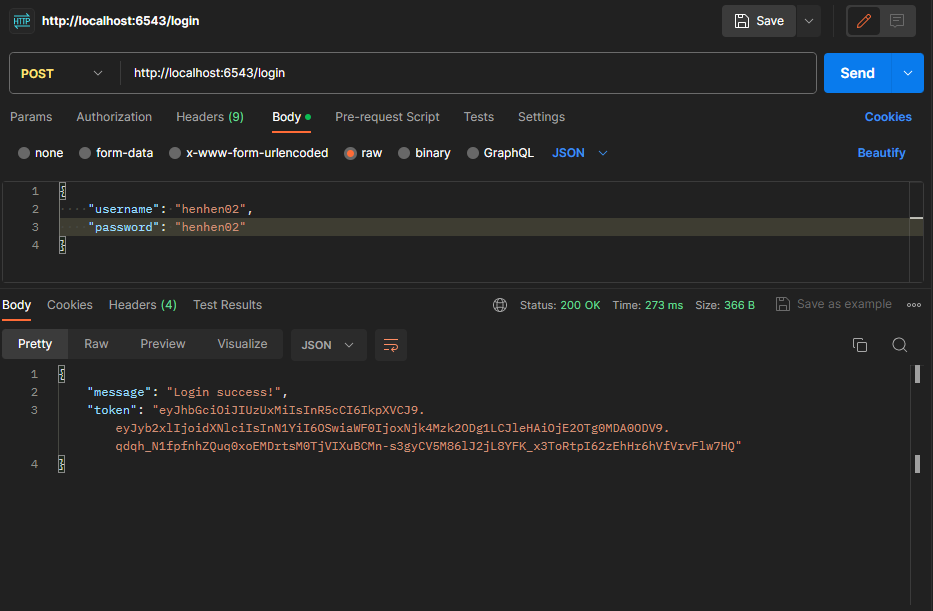
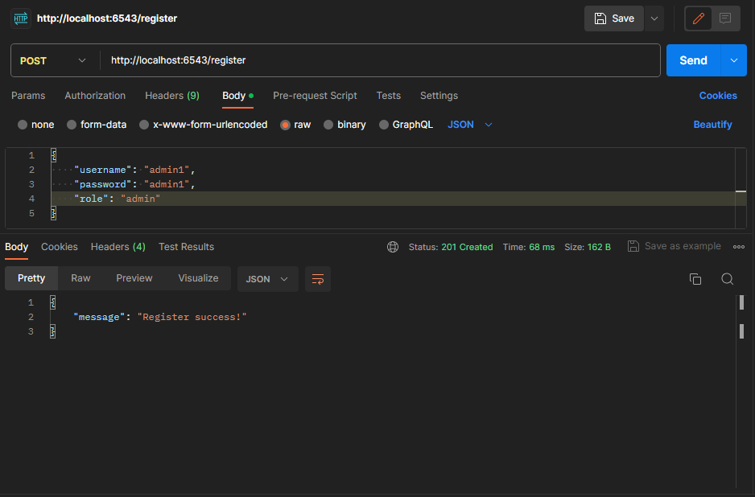
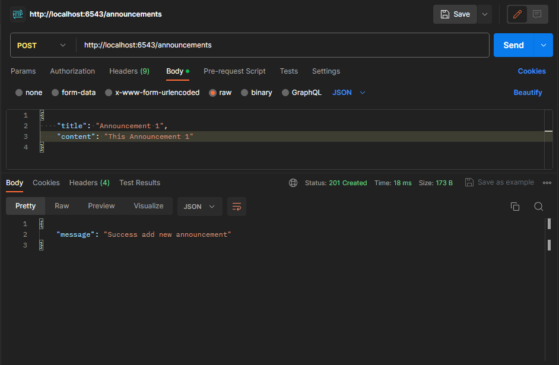

# Tugas Individu 4 Pemrograman WEB Lanjut

This app create using [python 3.11.6](https://pythoninsider.blogspot.com/2023/10/python-3116-is-now-available.html) with [Pyramid](https://docs.pylonsproject.org/projects/pyramid/en/latest/whatsnew-2.0.html) using package bundling from [Cookiecutter](https://github.com/Pylons/pyramid-cookiecutter-starter).

## Important !!!

> [!IMPORTANT]
> To be able to run this application, you are required to install python. (For Windows) Make sure that you install python through the official store that is available in your operating system. Besides the important things that have been mentioned before, I suggest you to install [Git](https://git-scm.com/downloads) to help you copy this repository practically, and [XAMPP](https://www.apachefriends.org/download.html) to create a database because this application will use a database as data storage in its operation.

## How to run this app ?

Make sure that you follow all the steps listed below.

### 1. Copy this repository

```
git clone
```

The above command will copy this repository into your computer. Wait until the clone process is finished.

### 2. Change to app directory

```
cd
```

You will be directed to the app directory using the command above.

### 3. Initialize Virtual Environment

```
python3 -m venv env
```

This will initialize the virtual folder as a node where the application dependencies will be downloaded and stored.

### 4. Activate Virtual Environment

```
env\Scripts\activate
```

The virtual environment will be activated, marked by the appearance of the virtual directory name on your terminal, for example you will see in your terminal:

```
(env) C:\app_directories>
```

### 5. Installing dependencies

The process can fail (depending on how you install python on your computer), so I provide several alternative commands that you can run to install dependencies:

```
env\Scripts\python.exe -m pip install -e .
```

or

```
env\Scripts\pip.exe install -e .
```

Make sure that when the dependency installation process is running, no error messages appear. If an error message appears, repeat the installation process from the beginning by following the steps that have been given.

### 6. Create database

Create a database through the XAMPP application (or similar, prioritize MySQL). You can open your XAMPP application and run MySQL. Then open the "Shell" menu to enter your username and password. If you are using XAMPP for the first time, you can use the following command:

- Login

```
mysql -u root
```

- Create new database

```
CREATE DATABASE pwl4
```

### 7. Create your firs migration

Migration will add a new model or table to your database.

```
env\Scripts\alembic.exe -c development.ini revision --autogenerate -m "Migrate to my db 1"
```

or

```
env\Scripts\alembic -c development.ini revision --autogenerate -m "Migrate to my db 1"
```

### 8. Apply migration

This step will apply some pending migration to your database

```
env\Scripts\alembic.exe -c development.ini upgrade head
```

or

```
env\Scripts\alembic -c development.ini upgrade head
```

### 9. Initialize your database

```
env\Scripts\initialize_pwl4_db.exe development.ini
```

### 10. Run this app

```
env\Scripts\pserve.exe development.ini
```

or

```
env\Scripts\pserve.exe development.ini --reload
```

You will see messages "Server run at port 6543" when you've accesd to [http://localhost:6543/](http://localhost:6543/). I suggest you to install Postman to perform some [CRUD](https://en.wikipedia.org/wiki/Create,_read,_update_and_delete#:~:text=In%20computer%20programming%2C%20create%2C%20read,computer%2Dbased%20forms%20and%20reports.) operations on this application.

- API List
  | No. | Name | Method | URL | Request Body | Required | Role |
  | --- | --- | --- | --- | --- | --- | --- |
  | 1. | Register | POST | http://localhost:6543/register | username, password, role (admin or user) | \- | all |
  | 2. | Login | POST | http://localhost:6543/login | username, password | Must be Registered | all |
  | 3. | Logout | GET | http://localhost:6543/logout | \- | \- | all |
  | 4. | Get All Announcements | GET | http://localhost:6543/announcements | \- | Must be Login first | all |
  | 5. | Get Announcement by Id | GET | http://localhost:6543/announcements/id | \- | Must be Login first | all |
  | 6. | Update Announcement | PUT | http://localhost:6543/announcements/id | title, content | Must be Login first | admin |
  | 7. | Delete Announcement | DELETE | http://localhost:6543/announcements/id | \- | Must be Login first | admin |
  | 8. | Create Announcement | POST | http://localhost:6543/announcements | title, content | Must be Login first | admin |
  | 9. | Get All users | GET | http://localhost:6543/user | \- | Must be Login first | admin |
  | 10. | Get User by Id | GET | http://localhost:6543/announcements/id | \- | Must be Login first | admin |

## Result

Example from hit some API

##### Login Users



##### Register as Admin



##### Create Announcement



## Author

[henhen02](https://github.com/henhen02) | 120140186
